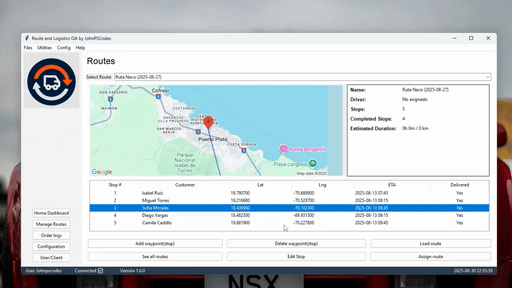
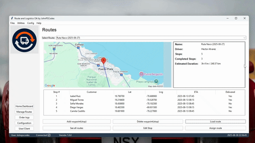
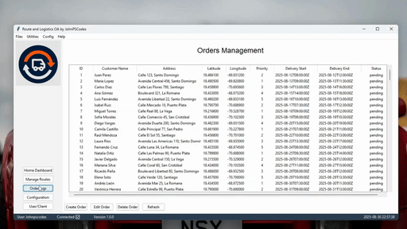
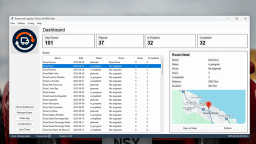

# 🚚 Route Optimization System 

A **route optimization system** combining a modular backend, a desktop GUI, and integration with external services.  
Built as a **Minimum Viable Product (MVP)** demonstrating secure APIs, database integration, and functional route management.

---

## ✨ Key Features

- 🔑 **JWT-secured authentication** for all API endpoints.  
- 📡 **Custom REST APIs** built with Django REST Framework, connected to a MySQL database.  
- 📚 **Automatic API documentation** using **drf-yasg**.  
- 🛠️ **Automated tests** for models and endpoints, ensuring maintainability and scalability.  
- 🌍 **Integration with Google APIs** (Maps, Distance Matrix, Directions) for real route and distance calculations.  
- 🖥️ **Desktop GUI with Tkinter/ttk**, implementing complete CRUD operations for all models.  
- 🗂️ **Relational database (MySQL)** with initial datasets for realistic testing.  
- 🧩 **Modular project structure (MVC pattern)** for easy scalability and maintenance.  
- 🔬 **API testing with Insomnia** and database management with **MySQL Workbench**.  
- 🌀 **Version control with Git**, enabling collaboration and continuous improvement.

---

## 🖼️ Demo
#### Login

#### Main Dashboard

#### Routes CRUD

#### Routes on GOOGLE MAPS

#### Orders CRUD

#### Utils

---

## 🛠️ Tech Stack

- **Language**: Python  
- **Backend**: Django + Django REST Framework  
- **Frontend**: Tkinter + ttk  
- **Database**: MySQL  
- **Authentication**: JWT  
- **External APIs**: Google Maps API, Google Distance Matrix API, Google Directions API  
- **Documentation**: drf-yasg  
- **Testing**: Insomnia, unittest/pytest  
- **Tools**: Git, MySQL Workbench  

---

### 📚 Lessons Learned

During development of this MVP:

- Designed and implemented a full **modular MVC architecture**.  
- Built and secured APIs with **JWT authentication**.  
- Integrated and tested external APIs, including **Google Maps, Distance Matrix, and Directions APIs**.  
- Worked with **relational databases** and structured datasets for realistic scenarios.  
- Developed a functional **desktop GUI** to manage CRUD operations.  
- Strengthened development practices with **automated testing** and **version control**.  

---

### 📇 Contact

- **GitHub**: [JohnPSCodes](https://github.com/JohnPSCodes)  
- **LinkedIn**: [Johander Pache Sanchez](https://linkedin.com/in/JohanderPacheSanchez)  
- **Email**: johnpscodes11@gmail.com  

---

## 🚀 Installation & Usage

Soon!

### 📄 License (MIT)

MIT License

Copyright (c) 2025 Johander Pache Sanchez

Permission is hereby granted, free of charge, to any person obtaining a copy  
of this software and associated documentation files (the "Software"), to deal  
in the Software without restriction, including without limitation the rights  
to use, copy, modify, merge, publish, distribute, sublicense, and/or sell  
copies of the Software, and to permit persons to whom the Software is  
furnished to do so, subject to the following conditions:

The above copyright notice and this permission notice shall be included in all  
copies or substantial portions of the Software.

THE SOFTWARE IS PROVIDED "AS IS", WITHOUT WARRANTY OF ANY KIND, EXPRESS OR  
IMPLIED, INCLUDING BUT NOT LIMITED TO THE WARRANTIES OF MERCHANTABILITY,  
FITNESS FOR A PARTICULAR PURPOSE AND NONINFRINGEMENT. IN NO EVENT SHALL THE  
AUTHORS OR COPYRIGHT HOLDERS BE LIABLE FOR ANY CLAIM, DAMAGES, OR OTHER  
LIABILITY, WHETHER IN AN ACTION OF CONTRACT, TORT OR OTHERWISE, ARISING FROM,  
OUT OF OR IN CONNECTION WITH THE SOFTWARE OR THE USE OR OTHER DEALINGS IN THE  
SOFTWARE.

